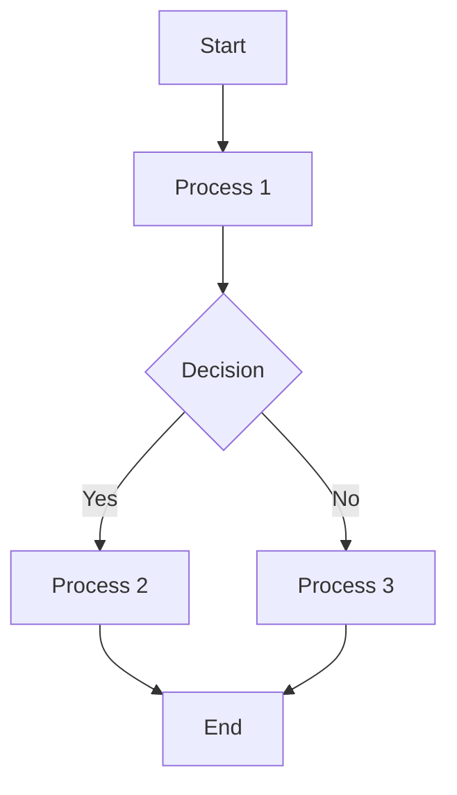
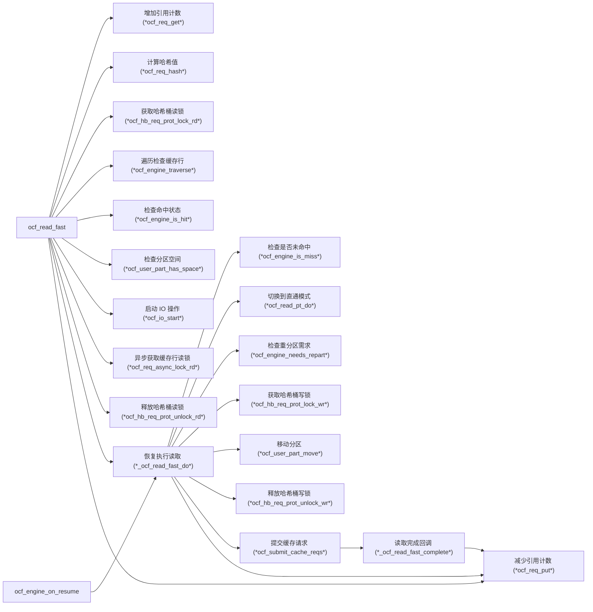
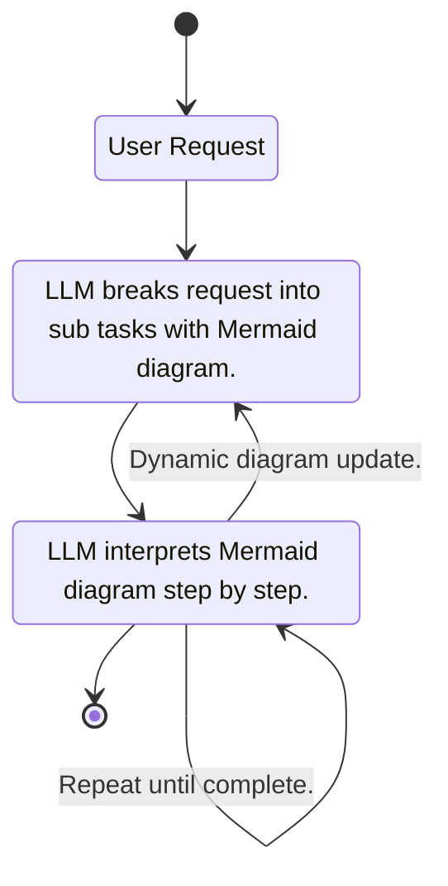
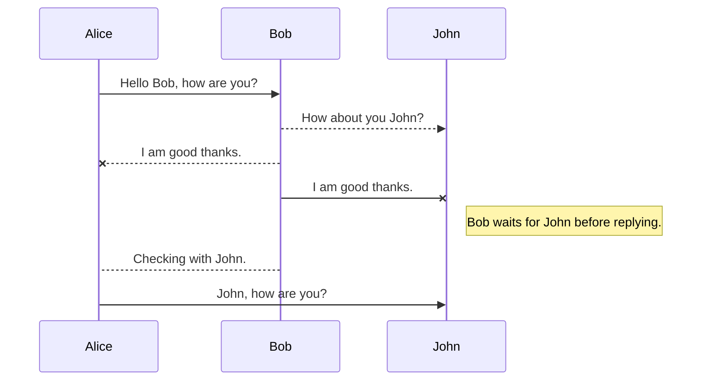
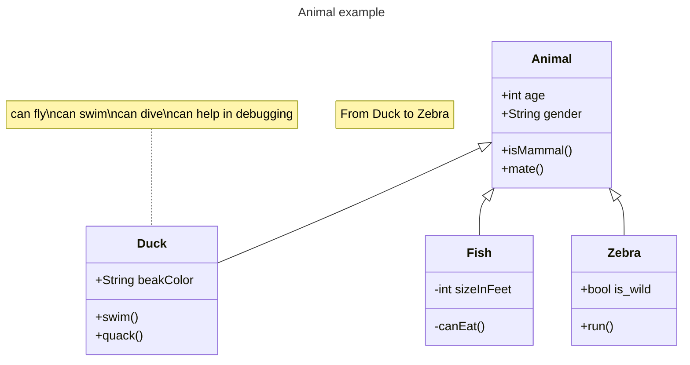

# Mermaid Examples

Use this file when code snippets are useful for selecting syntax or copying a starting point.

## Basic Flow

## Horizontal Code Call Graph

## State Diagram

## Sequence Diagram

## Class Diagram

