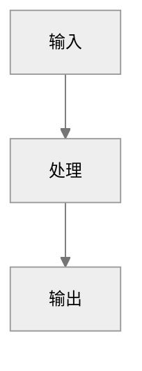
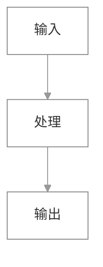
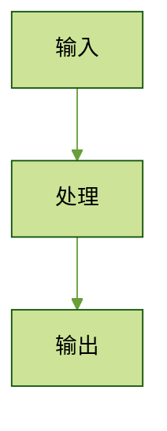
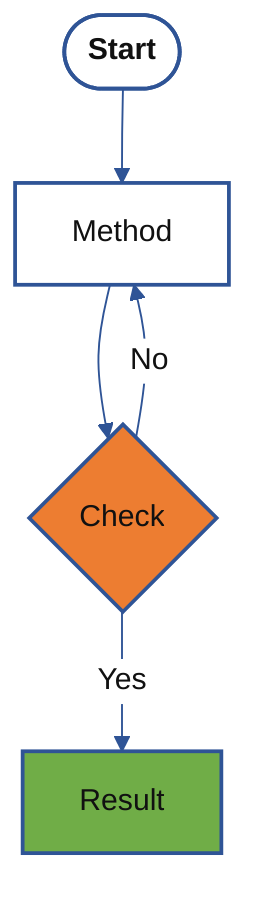

# Mermaid Style Snippets

Use this file when a concrete Mermaid style snippet is needed.

## Gray Whiteboard

```mermaid
%%{init: {"theme":"neutral","themeVariables":{"primaryColor":"#f5f5f5","primaryTextColor":"#212121","primaryBorderColor":"#9e9e9e","edgeLabelBackground":"#e0e0e0","tertiaryColor":"#eeeeee","fontFamily":"Helvetica Neue, sans-serif","fontSize":"13px","lineColor":"#757575","background":"#ffffff"}}}%%
graph TD
    A[输入] --> B[处理]
    B --> C[输出]
```

## White Hand-Drawn Board

```mermaid
%%{init: {"theme":"base","themeVariables":{"primaryColor":"#ffffff","primaryTextColor":"#333333","primaryBorderColor":"#888888","edgeLabelBackground":"#f4f4f4","tertiaryColor":"#f0f0f0","fontFamily":"Comic Sans MS, Chalkboard, cursive","fontSize":"15px","lineColor":"#999999","background":"#fdf6e3"}}}%%
graph TD
    A[输入] --> B[处理]
    B --> C[输出]
```

## Green Natural Board

```mermaid
%%{init: {"theme":"forest","themeVariables":{"primaryColor":"#dcedc8","primaryTextColor":"#33691e","primaryBorderColor":"#558b2f","edgeLabelBackground":"#f1f8e9","tertiaryColor":"#aed581","fontFamily":"Georgia, serif","fontSize":"15px","lineColor":"#689f38","background":"#f9fbe7"}}}%%
graph TD
    A[输入] --> B[处理]
    B --> C[输出]
```

## Research Diagram

```mermaid
%%{init: {"theme":"base","themeVariables":{"primaryColor":"#ffffff","primaryTextColor":"#111111","primaryBorderColor":"#2F5496","edgeLabelBackground":"#ffffff","tertiaryColor":"#ED7D31","fontFamily":"Arial, Times New Roman, sans-serif","fontSize":"12pt","lineColor":"#2F5496","background":"#ffffff"}}}%%
graph TD
    A([Start]) --> B[Method]
    B --> C{Check}
    C -->|Yes| D[Result]
    C -->|No| B
    classDef startEnd fill:#ffffff,stroke:#2F5496,stroke-width:2px,font-weight:bold
    classDef method fill:#ffffff,stroke:#2F5496,stroke-width:2px
    classDef accent fill:#ED7D31,stroke:#2F5496,stroke-width:2px
    classDef result fill:#70AD47,stroke:#2F5496,stroke-width:2px
    class A startEnd
    class B method
    class C accent
    class D result
```
